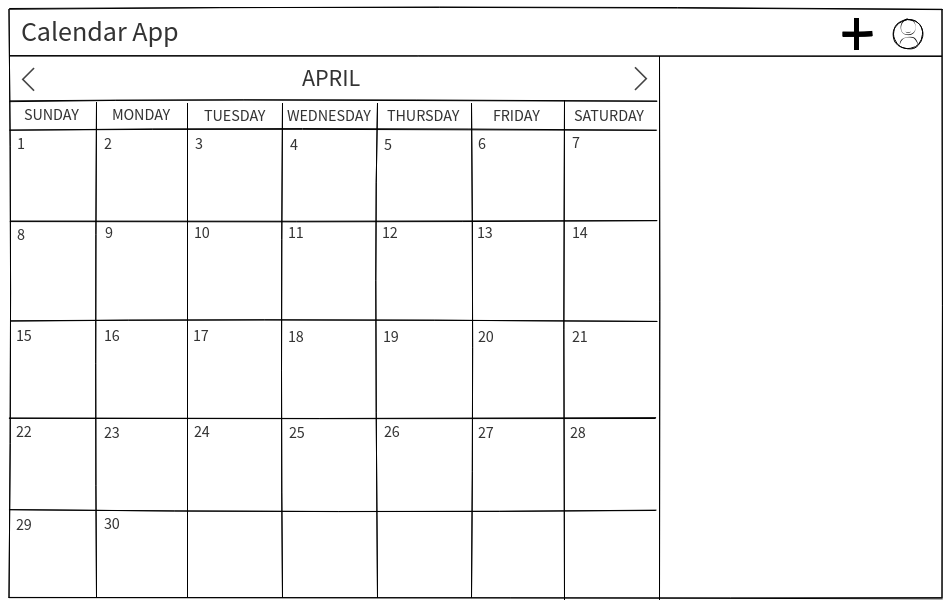
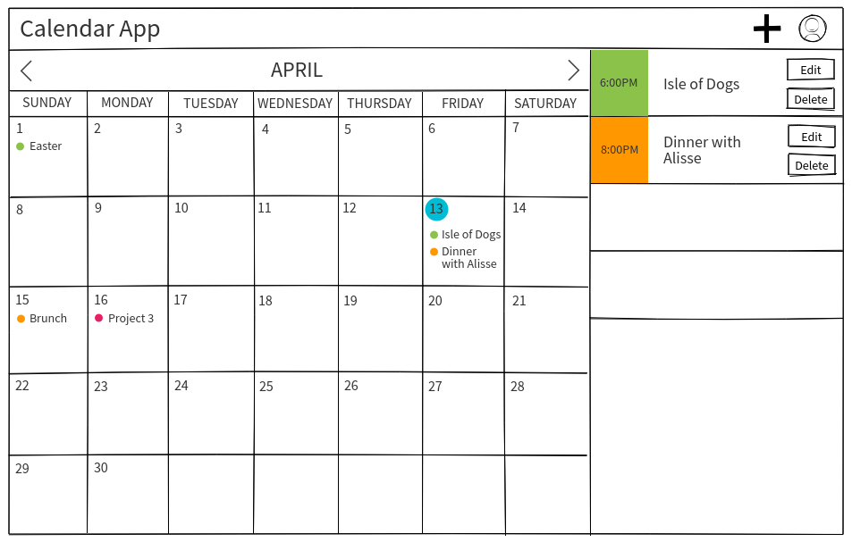
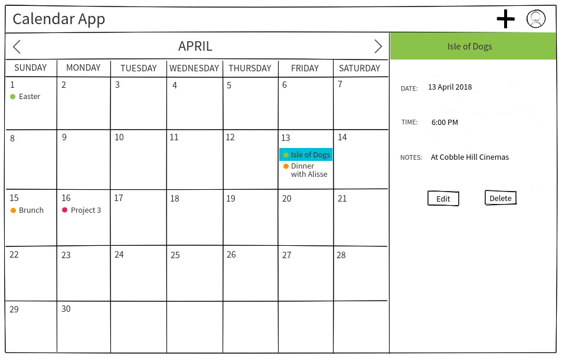
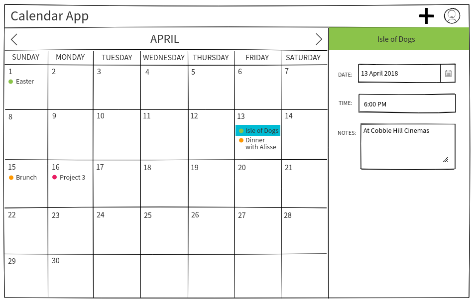
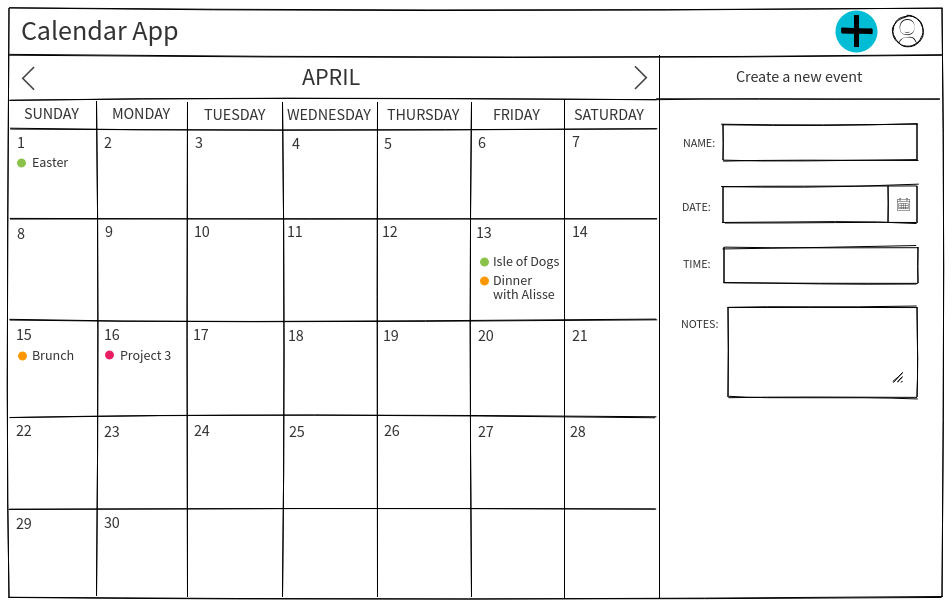
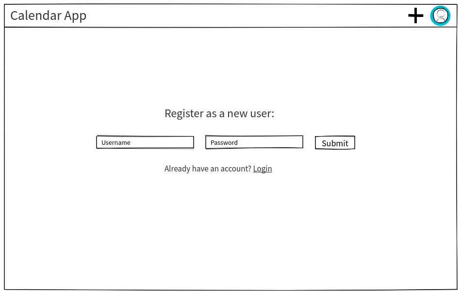
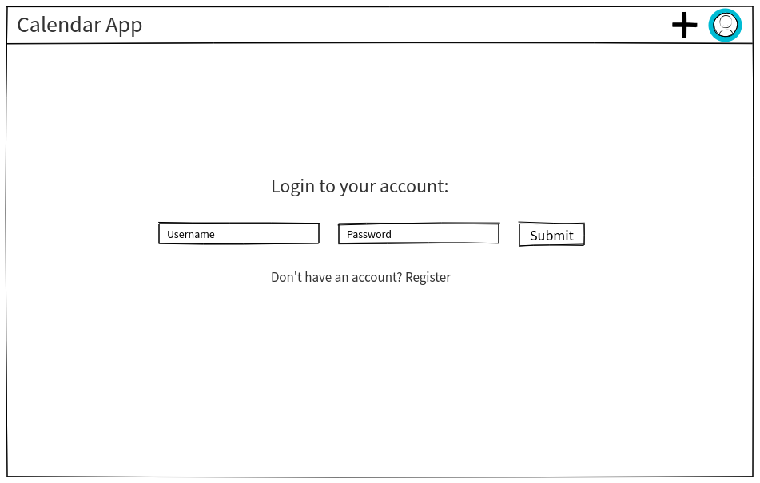
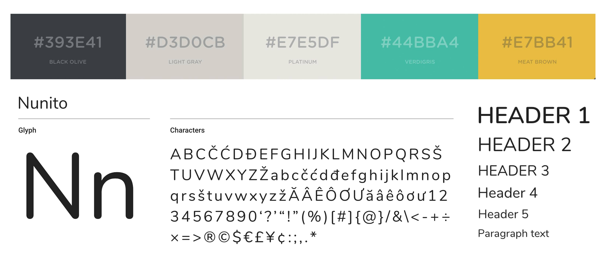

# Calendar App
A calendar web app where users can create, edit, delete, and view upcoming and past events.

### Explanations of the technologies used
- `bluebird`- library designed specifically for handling promises
- `body-parser`-  middleware useful for parsing through data that can be accessed through request.body (most often used to access form inputs)
- `cors`- Cross-Origin Resource Sharing, allows for cross-domain communication from the browser, were specifically have been using it to allow the backend (Express) communicate with the front-end React.
- `express` - Express is necessary for setting up routes between the server and client, as well as working/creating APIs, such as the ones we created with our database.
- `pg-monitor`- logs events related to postgreSQL, npm package, works through node
- `pg-promise`- runs on top of node-postreSQL, allows for interconnectivity between postgreSQL, the server, and the client
- `moment.js` -time can be particularly complex to work with because a single instance of time can be quantified using many different dimensions such as year, day, time of day, second, minute, time zone,  and time zone. Moment.js  allows for javascript to parse through and better manipulate the these different dimensions, as well as deal with data localization.

### Installation instructions for dependencies
- Run `yarn install` and `node server.js` in the root of the directory
- Run `yarn install` and `yarn start` in the `calendar_app` directory

## General features:
- Monthly view — selecting a date would reveal more info about that day's events
- Adding/creating events
- `moment.js` library for handling date localization
- User auth
- Potential 3rd party APIs: Google Calendar, Facebook Calendar, ESPN, Eventbrite (we'll probably pick one if we have time)

## Wireframes
      

## Style Guide

